---

## 1. Service Architecture

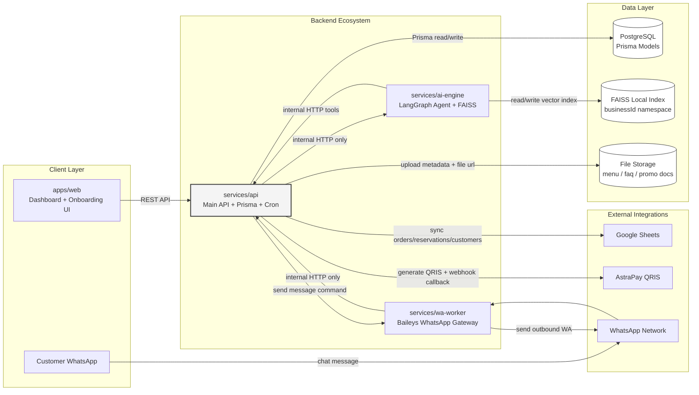

---

## 2. MVP Goal Flow — From Register to Live Bot

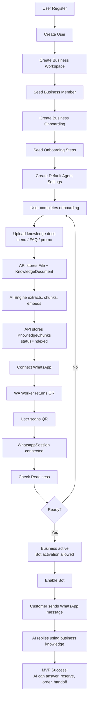

---

## 3. Register + Workspace Transaction

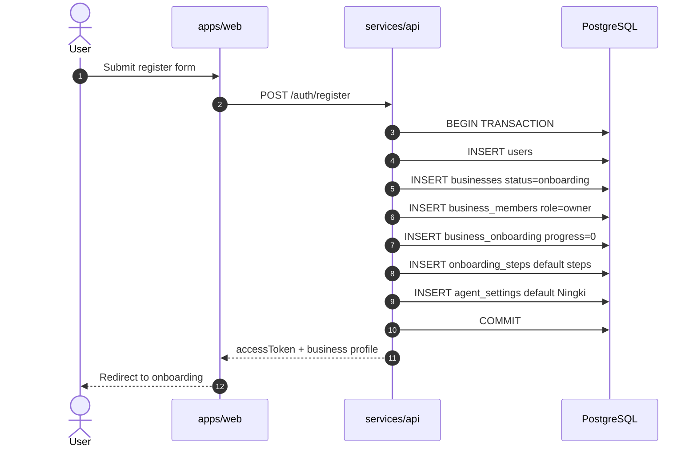

---

## 4. Onboarding Guided Setup

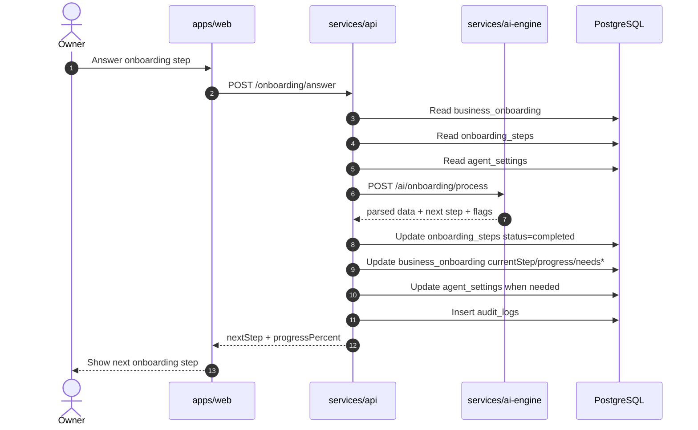

---

## 5. Knowledge Upload + Indexing

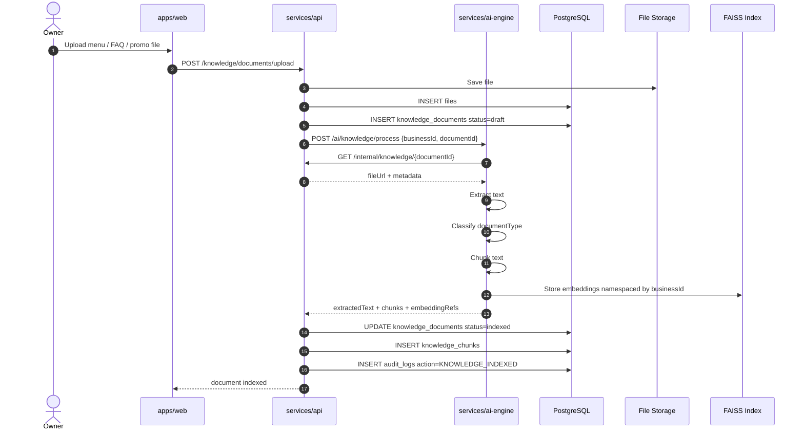

---

## 6. WhatsApp Connect + Bot Enable

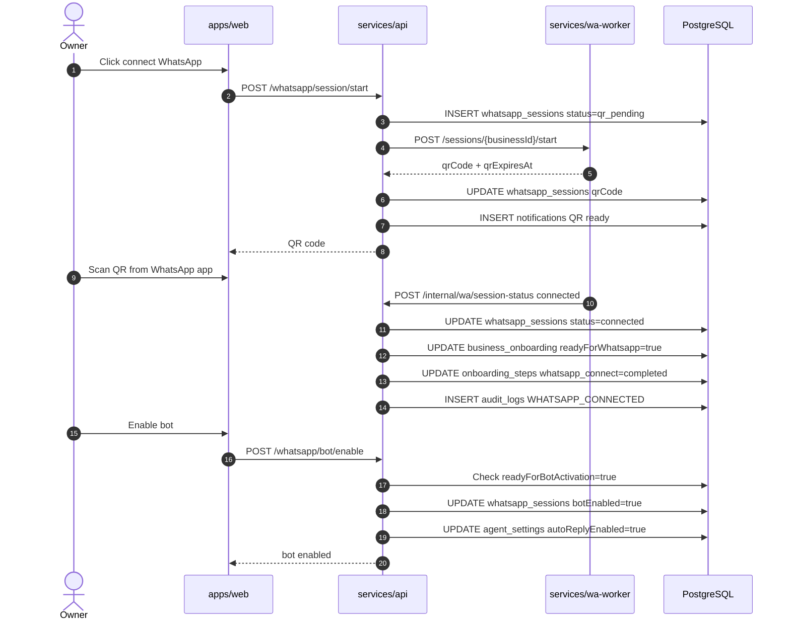

---

## 7. Incoming WhatsApp Message + AI Reply

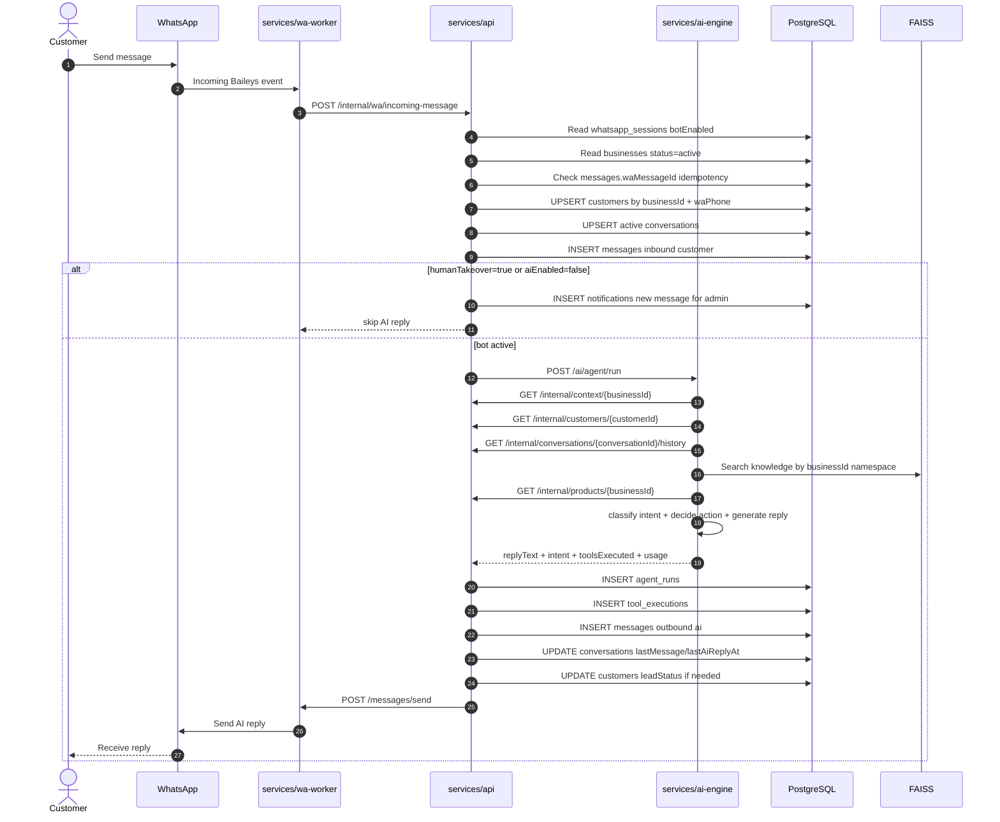

---

## 8. AI Agent Internal Graph

```mermaid
flowchart TD
  A["receive_message"] --> B["load_business_context"]
  B --> C["load_customer_profile"]
  C --> D["load_conversation_history"]
  D --> E["check_human_takeover"]

  E --> F{"Human takeover?"}
  F -->|"Yes"| G["stop_ai_reply<br/>notify admin"]
  F -->|"No"| H["classify_intent"]

  H --> I["retrieve_knowledge<br/>FAISS by businessId"]
  I --> J["decide_action"]
  J --> K{"Need tool?"}

  K -->|"No"| L["generate_reply"]
  K -->|"Yes"| M["tool_router"]

  M --> N{"Tool type"}
  N -->|"reservation"| O["create_reservation_tool"]
  N -->|"order"| P["create_order_tool"]
  N -->|"payment"| Q["create_payment_qris_tool"]
  N -->|"handoff"| R["human_handoff_tool"]
  N -->|"knowledge"| S["knowledge_search_tool"]```mermaid


  O --> T["execute_tool via services/api"]
  P --> T
  Q --> T
  R --> T
  S --> T

  T --> U["save_state"]
  U --> L
  L --> V["return_reply_to_api"]
```

---

## 9. Reservation via AI Tool

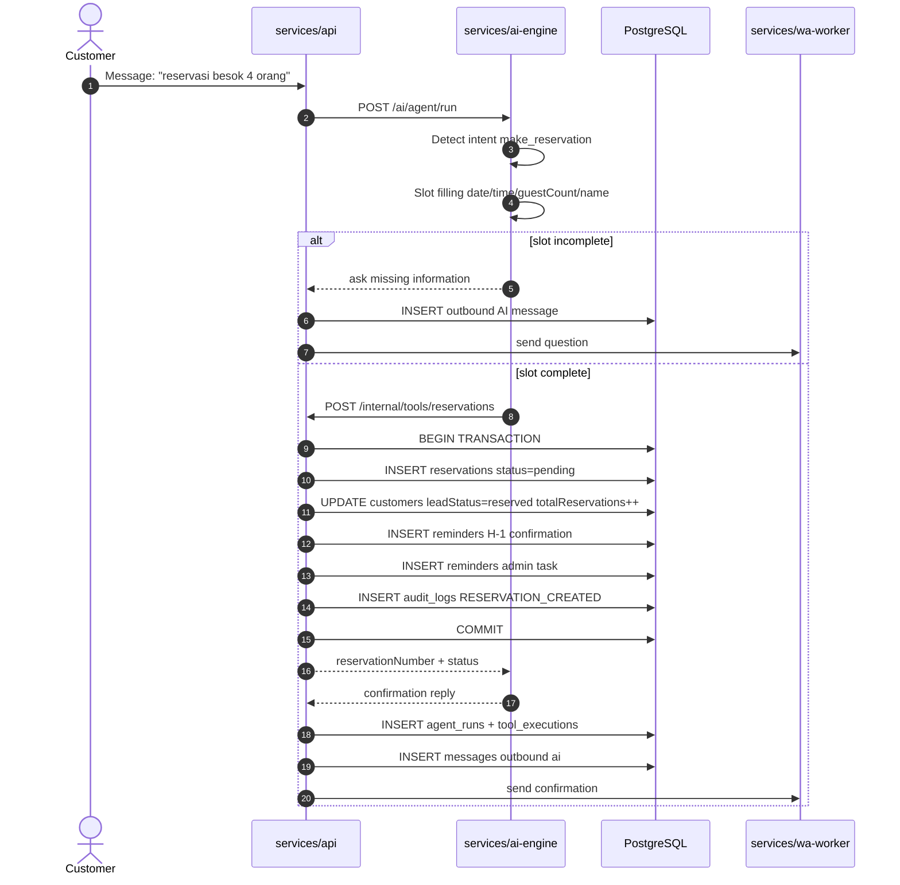

---

## 10. Order via AI Tool

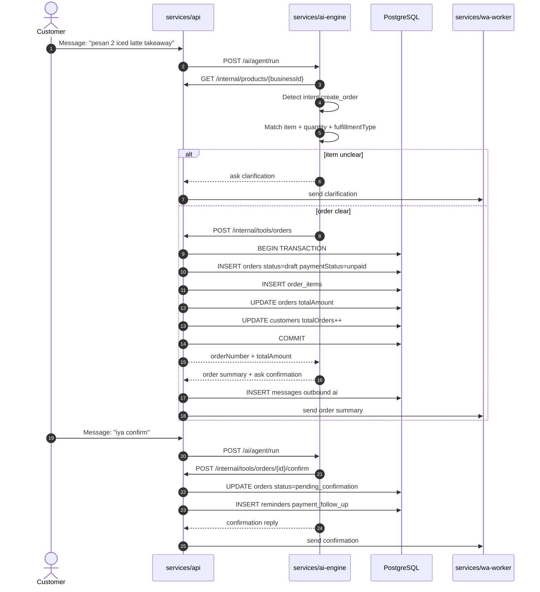

---

## 11. Human Handoff Flow

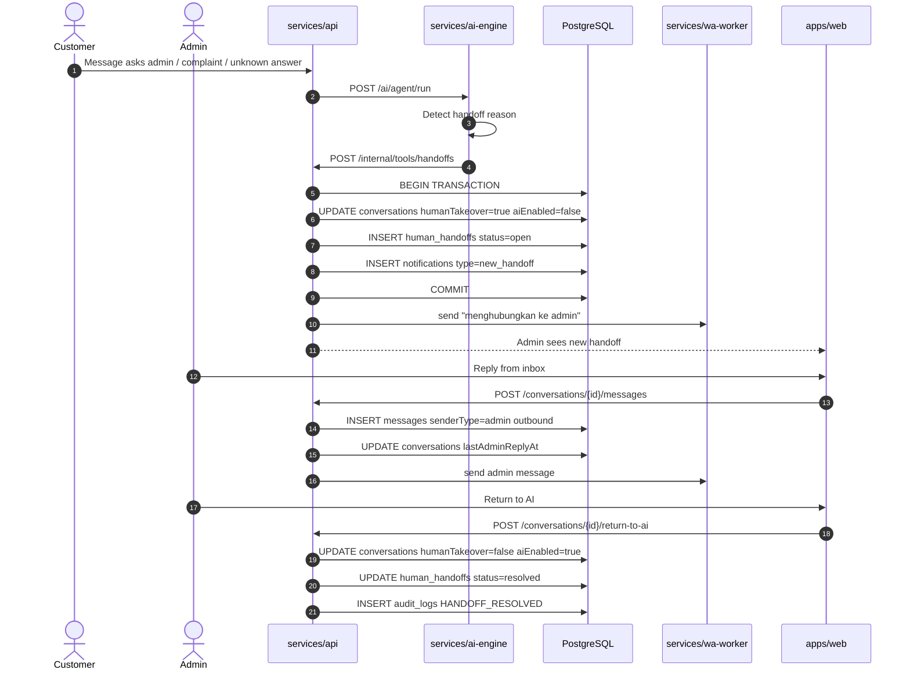

---

## 12. API Module Dependency Map

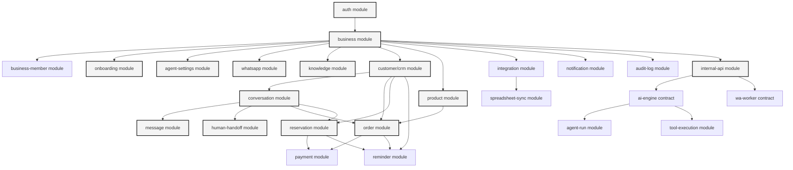

---

## 13. MVP Endpoint Group Map

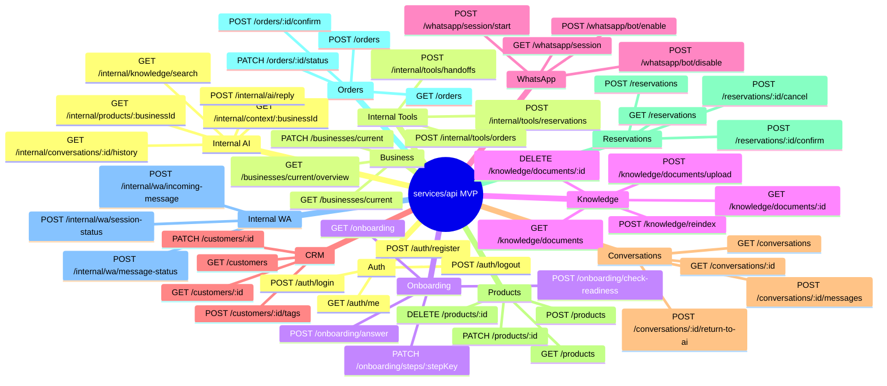

---

## 14. Database Domain Map

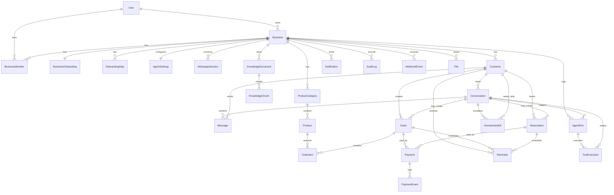

---

## 15. MVP Backend Build Order

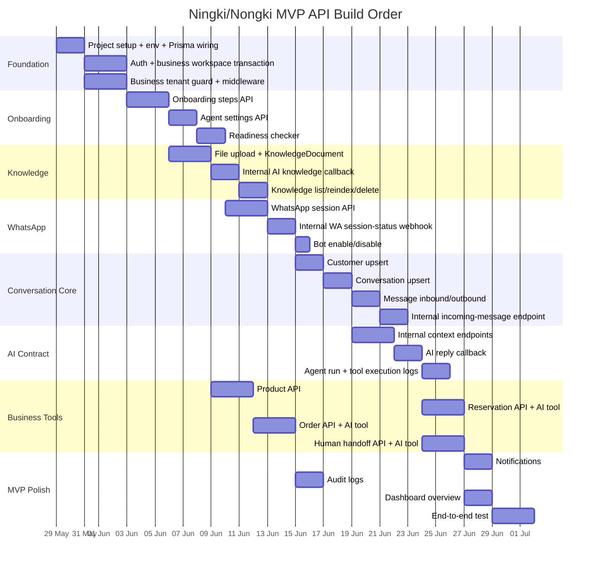

---

## 16. MVP Success State

```mermaid
flowchart LR
  A["Owner can register"] --> B["Business workspace created"]
  B --> C["Onboarding completed"]
  C --> D["Knowledge indexed"]
  D --> E["WhatsApp connected"]
  E --> F["Bot enabled"]
  F --> G["Customer sends message"]
  G --> H["API saves customer/conversation/message"]
  H --> I["AI gets context + knowledge"]
  I --> J["AI replies"]
  J --> K["WA Worker sends reply"]
  K --> L["Admin can view inbox"]
  L --> M["AI can create reservation/order"]
  M --> N["AI can handoff to admin"]
```